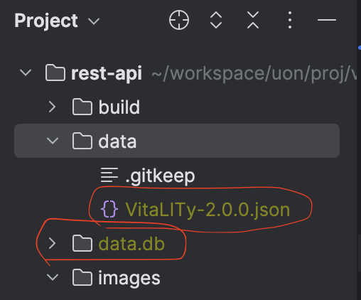

## How to start

### 1. Download the data

link: [google drive](https://drive.google.com/drive/folders/1OiiwSi8aYb0w6fh8rpTMZS7MupO3pE0S)

As you can see, there are two file in the folder. 

- One is `VitaLITy-2.0.0.json`, This is the paper dataset. 
- The other is `data.db.zip`, which contains information about the chromadb data set. I use this to retrieve data when performing enhancements. After downloading, please unzip it and place the `data.db` folder in the project root folder.

The directory structure is as shown below.

### 2. Install depedency

Your Python version require >= 3.8

just run `pip install -r ./requirements.txt` to install the depedency.

### 3. Add open ai key to .env

Since the key is sensitive content, Please see the email I sent you before. It contains OPENAI_API_KEY

### 4. start the server

If you use Pycharm, just click the green arrow in `server.py` to run server.

Otherwise you can also run `python server.py` to start the server.

Now hope that you can start the server normally. If you have any questions, you can ask me via email/slack.
